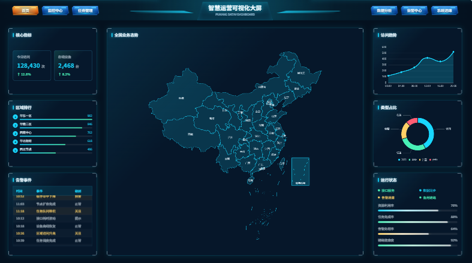

# pukang-datav

`pukang-datav` 是一套基于 Vue 3 的可视化大屏组件库，面向数据驾驶舱、指挥中心、运营监控、地图态势、设备看板等场景。

组件统一使用 `pk-dv-` 前缀，提供大屏画布、定位布局、数据展示、ECharts 图表封装、地图空间组件和科技感装饰组件，帮助项目更快搭建稳定、可复用的大屏页面。

## 特性

- Vue 3 组件库，支持全量注册和按需引入。
- 面向 1920x1080 等固定设计稿尺寸的大屏适配。
- 内置大屏基础容器、定位层、栅格、分组和渐变背景面板。
- 封装常用数据展示组件，如指标卡、数字翻牌、排行、滚动表格、状态灯、时间组件。
- 基于 ECharts 封装折线图、柱状图、饼图、仪表盘、雷达图和中国地图组件。
- 提供边框、发光标题、菜单按钮、装饰线、通知、进度条等大屏氛围组件。
- 样式以深色科技风为主，适合可视化驾驶舱快速落地。

## 安装

```bash
npm install pukang-datav
```

或：

```bash
yarn add pukang-datav
```

## 完整引入

```js
import { createApp } from 'vue'
import PukangDatav from 'pukang-datav'
import 'pukang-datav/style.css'
import App from './App.vue'

createApp(App).use(PukangDatav).mount('#app')
```

## 基础用法

```vue
<template>
  <pk-dv-screen :width="1920" :height="1080" fit="contain" background="#04111f">
    <pk-dv-layer :x="0" :y="0" width="1920px" height="92px">
      <pk-dv-header-title title="智慧运营可视化大屏" sub-title="PUKANG DATAV DASHBOARD" />

      <div class="menu menu--left">
        <pk-dv-menu-button label="首页" active />
        <pk-dv-menu-button label="监控中心" />
        <pk-dv-menu-button label="任务管理" />
      </div>
    </pk-dv-layer>

    <pk-dv-layer :x="40" :y="116" width="360px" height="270px">
      <pk-dv-border-box title="核心指标" padding="18px">
        <pk-dv-stat-card title="今日访问" :value="128430" unit="次" trend="12.6%" />
      </pk-dv-border-box>
    </pk-dv-layer>
  </pk-dv-screen>
</template>
```

## 按需引入

```js
import { PkDvScreen, PkDvLayer, PkDvBorderBox } from 'pukang-datav'
import 'pukang-datav/style.css'
```

## 组件清单

### 基础容器

- `pk-dv-screen`：大屏画布，支持固定设计尺寸和适配缩放。
- `pk-dv-layer`：绝对定位图层，适合自由布局大屏模块。
- `pk-dv-grid`：栅格容器，适合规则网格布局。
- `pk-dv-cell`：栅格单元格，控制跨列与跨行。
- `pk-dv-group`：弹性分组容器，用于横向或纵向排列。
- `pk-dv-panel`：通用面板容器，支持标题、内容区、边框和阴影。
- `pk-dv-header-title`：大屏顶部主标题，支持副标题和发光动效。
- `pk-dv-menu-button`：大屏菜单按钮，适合顶部导航、模块切换和底部 Dock。
- `pk-dv-gradient-panel`：纯渐变背景面板，支持左右渐变、两头渐变、插槽内容和尺寸配置。

### 数据展示

- `pk-dv-stat-card`：指标卡，支持标题、数值、单位、趋势和状态色。
- `pk-dv-digital-number`：数字翻牌器，支持动画、千分位、前缀和后缀。
- `pk-dv-rank-list`：排行列表，支持进度条和 Top N 展示。
- `pk-dv-scroll-table`：滚动表格，适合告警、事件和任务列表。
- `pk-dv-status-dot`：状态灯，支持在线、离线、告警、异常、处理中等状态。
- `pk-dv-time`：时间组件，支持格式化和定时刷新。

### 图表组件

- `pk-dv-chart`：ECharts 通用图表容器，支持 option、resize 和 loading。
- `pk-dv-line-chart`：折线图，支持平滑曲线和面积填充。
- `pk-dv-bar-chart`：柱状图，支持横向柱状图。
- `pk-dv-pie-chart`：饼图和环图，支持玫瑰图。
- `pk-dv-gauge-chart`：仪表盘，适合百分比和运行状态指标。
- `pk-dv-radar-chart`：雷达图，适合能力维度和综合评分。

### 地图空间

- `pk-dv-map-canvas`：空间态势画布，适合承载点位、飞线和浮层。
- `pk-dv-point-map`：点位地图，支持百分比坐标、状态色和点击事件。
- `pk-dv-flyline-map`：飞线地图，支持源点、目标点和流动动画。
- `pk-dv-geo-panel`：地图信息浮层，适合点位详情和区域指标。
- `pk-dv-map-china`：基于 ECharts 的中国地图组件，通过 `geoJson` 注册地图数据。

### 装饰氛围

- `pk-dv-border-box`：装饰边框，适合包裹面板、图表和浮层。
- `pk-dv-decoration`：装饰线，支持线条、斜块、角标和分割线。
- `pk-dv-glow-title`：发光标题，适合模块标题和分区标题。
- `pk-dv-scroll-notice`：滚动通知，适合告警播报和消息横幅。
- `pk-dv-progress`：线性进度条，展示完成率、负载率等指标。
- `pk-dv-ring-progress`：环形进度，展示健康度、利用率等百分比指标。

## 中国地图说明

`pk-dv-map-china` 不内置 GeoJSON 数据。实际项目中可以按需传入中国、省、市等地图数据：

```vue
<pk-dv-map-china
  map-name="china"
  :geo-json="geoJson"
  :data="data"
  :height="640"
/>
```

## 构建

```bash
npm run build
```

## 浏览器支持

建议用于现代浏览器环境。大屏项目通常推荐 Chrome、Edge 等 Chromium 内核浏览器。

## 开源声明

本项目基于 MIT License 开源。你可以自由使用、复制、修改、合并、发布、分发、再授权或用于商业项目，但需要保留原始版权声明和许可证声明。

详细说明请阅读 [OPEN_SOURCE.md](./OPEN_SOURCE.md) 和 [LICENSE](./LICENSE)。

## License

[MIT](./LICENSE) © 2026 Pukang
